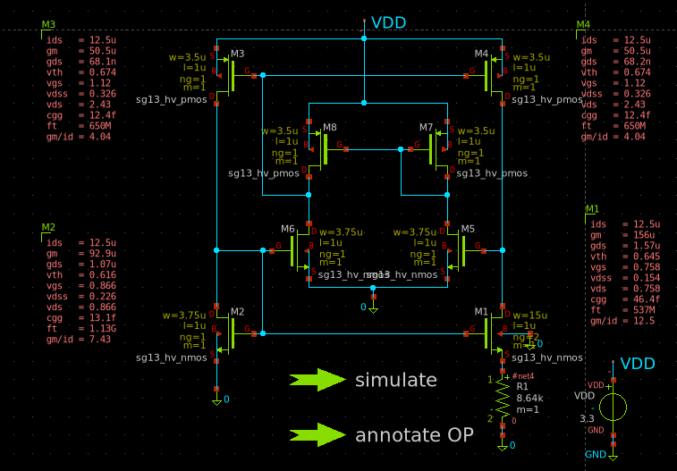
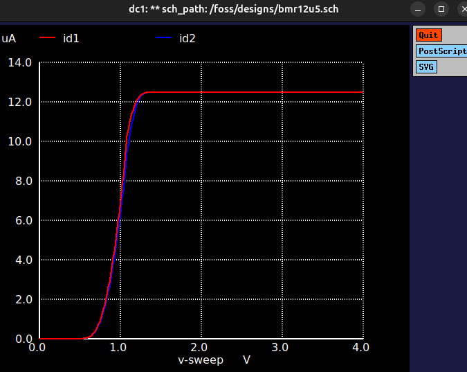
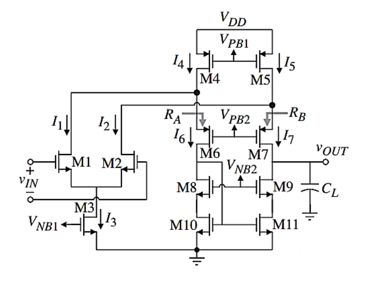
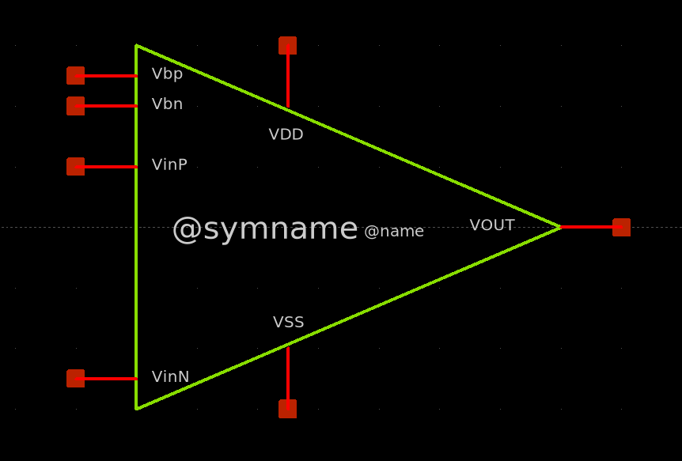
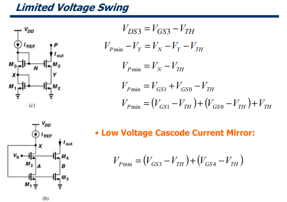
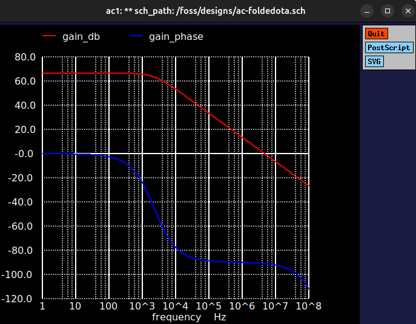
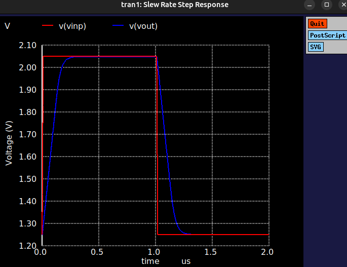
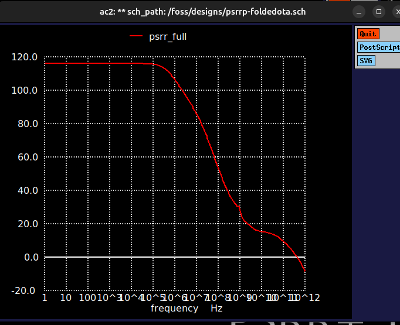
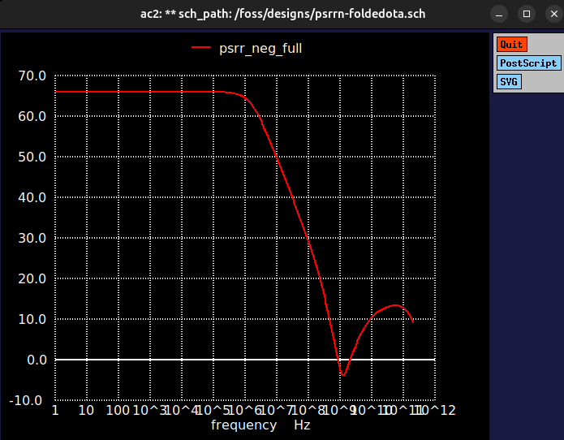

# High-PSRR Folded Cascode OTA — IHP SG13G2

Folded cascode operational transconductance amplifier, designed and verified in ngspice/xschem on the IHP SG13G2 130nm BiCMOS PDK.

> **Update — improved version available:** `v2_bmr_bias/` is a better version of this design. The ideal current sources used in v1 have been removed and replaced by a **beta-multiplier reference (BMR)** circuit that generates the bias. See [Version 2](#version-2--bmr-bias-no-ideal-current-sources).

## Versions

| Version | Folder | Biasing | Status |
|---|---|---|---|
| v1 | `v1_ideal_current_sources/` | Ideal current sources | Complete, full results below |
| v2 | `v2_bmr_bias/` | BMR (`BMR12u5`) | Improved version, no ideal sources |

## Repo structure

```
foldedOTA-sg13g2/
├── README.md
├── LICENSE
├── theory/
│   ├── limited_voltage_swing_vs_cascode_current_mirror.png
│   ├── low_voltage_cascode_current_mirror.png
│   └── classic_cascode_current_mirror.png
├── v1_ideal_current_sources/
│   ├── schematic/
│   │   ├── foldedOTA.sch
│   │   ├── foldedOTA.spice
│   │   ├── foldedOTA.sym
│   │   ├── symbol.png
│   │   ├── folded_cascode_sch.png
│   │   └── FoldedCascode.png
│   ├── op/
│   │   └── OP-foldedOTA.sch / .spice / .save / .raw
│   ├── closedloop/
│   │   ├── CL-foldedOTA.sch / .spice
│   │   ├── ClosedLoopGain.png
│   │   └── ClosedLoopTB.png
│   ├── ac/
│   │   ├── AC-foldedOTA.sch / .spice
│   │   ├── ACresponse.png
│   │   ├── OpenLoopGain.png
│   │   ├── OpenLoopPhase.png
│   │   └── OLPhase_Gain.png
│   ├── slew_rate/
│   │   ├── SR-foldedOTA.sch / .spice
│   │   ├── SlewRateTB.png
│   │   └── slew_rate_step_response.png
│   ├── cmrr/
│   │   ├── CMRR-foldedOTA.sch / .spice
│   │   ├── CMRRTB.png
│   │   └── cmrr_plot.png
│   └── psrr/
│       ├── PSRRp-foldedOTA.sch / .spice, PSRRp.png, PSRRpTB.png
│       └── PSRRn-foldedOTA.sch / .spice, PSRRn.png, PSRRnTB.png
└── v2_bmr_bias/
    ├── BMR12u5.sch
    ├── symbol.sch / symbol.sym
    ├── OP.sch
    ├── ACsim.sch
    ├── CMRRsim.sch
    ├── PSRR+.sch
    └── images/
        ├── BMR.png
        └── BMR-VDDsweep.png
```

---

## Version 2 — BMR bias, no ideal current sources

The v1 design was biased with ideal current sources, which do not exist on silicon. In v2 they are removed and the bias currents come from a beta-multiplier reference (`BMR12u5.sch`) built from SG13G2 devices, so the OTA is biased by a circuit that could actually be fabricated.




Contents of `v2_bmr_bias/`:

- `BMR12u5.sch` — the beta-multiplier reference bias circuit
- `symbol.sch` / `symbol.sym` — OTA symbol used by the testbenches
- `OP.sch` — operating point
- `ACsim.sch` — open-loop gain and phase
- `CMRRsim.sch` — common-mode rejection
- `PSRR+.sch` — positive supply rejection

### Performance (typical corner)

| Spec | Target | v1 (ideal sources) | v2 (BMR) |
|---|---|---|---|
| DC gain | ≥ 60 dB | 66.5 dB | 67.4 dB |
| Phase margin | ≥ 60° | 88.9° | 88.77° |
| GBW | 5 MHz | 4.76 MHz | 4.87 MHz |
| PSRR+ | > 80 dB | 116.0 dB | 135.7 dB |
| CMRR | — | 106.2 dB | 106.7 dB |

---

## Version 1 — ideal current sources

Everything below describes `v1_ideal_current_sources/`.




### Why a cascode current mirror

A simple current mirror mirrors current with output resistance ≈ `ro` (the drain-source resistance of that one device). Stacking a cascode device on top boosts that branch's own resistance to roughly `gm·ro` times itself — i.e. each branch scales by its own `gm` and `ro`, not a shared value. The NMOS and PMOS branches don't have the same `ro` (different mobility, sizing, bias current), so the output resistance at the OTA's output node is:

```
Rout = RoutN || RoutP
```

where `RoutN` is the cascode-boosted resistance looking into the NMOS side and `RoutP` the cascode-boosted resistance looking into the PMOS side. Cascoding raises `RoutN` and `RoutP` independently, which:

- reduces current mismatch from channel-length modulation across PVT and VDS variation
- gives the mirror a high enough output impedance that it doesn't limit the OTA's DC gain (gain ∝ Rout at the output node)

The cost is headroom: cascoding a mirror stacks two `VGS` drops on top of the current source, eating into the voltage swing available at that node.

#### Limited-swing (classic) cascode vs. low-voltage cascode



In the classic diode-connected cascode mirror (top schematic, (c)), the cascode gate is set by a diode-connected device in the same stack, so:

```
V_Pmin = (V_GS1 − V_TH) + (V_GS0 − V_TH) + V_TH
```

That trailing `+V_TH` is dead headroom — it doesn't buy any overdrive, it's just there because the gate bias is generated in-stack.

The low-voltage cascode mirror (bottom schematic, (b)) generates the cascode gate bias `V_b` externally instead, so:

```
V_Pmin = (V_GS3 − V_TH) + (V_GS4 − V_TH)
```

Same high output impedance, one fewer `V_TH` of required headroom — that matters whenever supply/swing margin is tight, which is why the low-voltage version is used here.

### Performance: target vs. achieved (typical corner)

| Spec | Target | Achieved | Result |
|---|---|---|---|
| DC gain | ≥ 60 dB | 66.5 dB | Pass |
| Phase margin | ≥ 60° | 88.9° | Pass |
| GBW | 5 MHz | 4.76 MHz | ~5% short |
| Slew rate (rise) | 5 V/µs | 4.57 V/µs | ~9% short |
| Slew rate (fall) | 5 V/µs | 4.49 V/µs | ~10% short |
| PSRR+ | > 80 dB | 116.0 dB | Pass |
| PSRR− | > 60 dB | 66.0 dB | Pass |
| CMRR | — | 106.2 dB | — |






## Folded cascode vs. telescopic cascode vs. 5T OTA

The folded cascode topology "folds" the cascode devices onto the opposite current-source branch (PMOS folding onto an NMOS input pair or vice versa), which decouples the input common-mode range from the output swing — unlike telescopic cascode, where everything stacks on one rail.

| | 5T OTA | Telescopic cascode | Folded cascode |
|---|---|---|---|
| Gain | Low (single `gm·ro` stage, no cascode boost) | High (`RoutN \|\| RoutP`, both branches cascode-boosted) | High (`RoutN \|\| RoutP`, both branches cascode-boosted) |
| Output swing | Good | Poor (stacked devices eat headroom) | Better (folding relieves stacking) |
| Input common-mode range | Moderate | Limited | Wide |
| Power | Lowest | Moderate | Highest (extra folding branches) |
| Bandwidth | Highest (fewest parasitic nodes) | High | Moderate (folding node adds a pole) |
| Design complexity | Simplest | Simple | More biasing branches to size |
